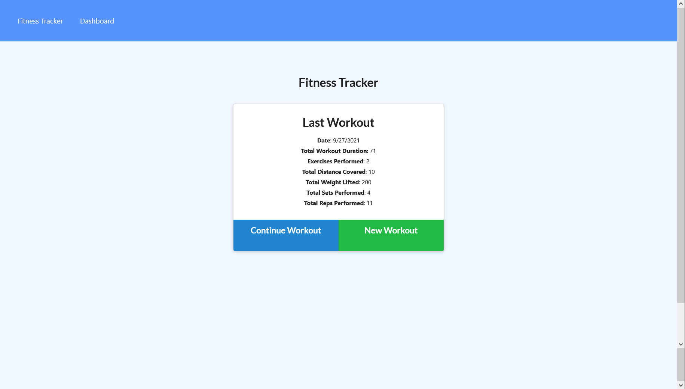
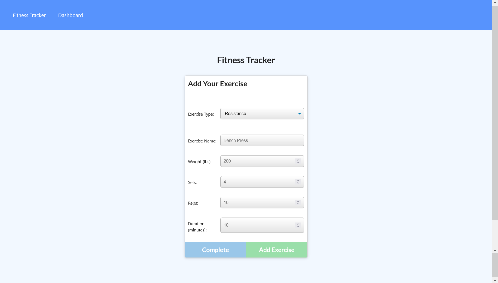
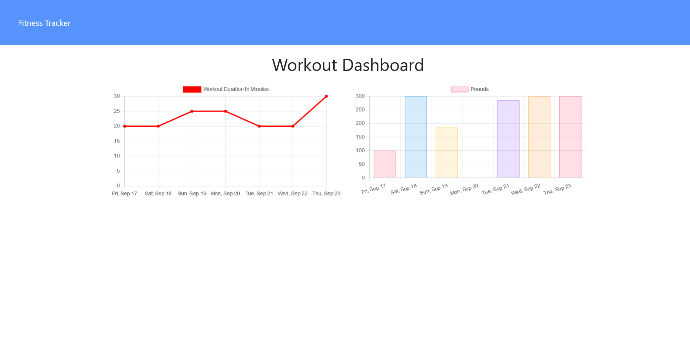

<details open="open">
  <summary><h2 style="display: inline-block">Table of Contents</h2></summary>
  <ol>
    <li>
      <a href="#about-the-project">About The Project</a>
      <ul>
        <li><a href="#built-with">Built With</a></li>
      </ul>
    </li>
    <li>
      <a href="#getting-started">Getting Started</a>
      <ul>
        <li><a href="#prerequisites">Prerequisites</a></li>
        <li><a href="#installation">Installation</a></li>
      </ul>
    </li>
    <li><a href="#usage">Usage</a></li>
    <li><a href="#license">License</a></li>
    <li><a href="#contact">Contact</a></li>
    <li><a href="#acknowledgements">Acknowledgements</a></li>
  </ol>
</details>

## About The Project

Fitness Tracker





An app which keeps track of new and previously added workouts and functions as a dashboard for a user's workout information

- Webpage: [https://shielded-brook-90200.herokuapp.com/]()
- Github page: [https://github.com/Zd092718/workouttracker]()

### Built With

- HTML
- CSS
- Javascript
- Mongoose
- MongoDB
- Express.js

<!-- GETTING STARTED -->

## Getting Started

To get a local copy up and running follow these simple steps.

### Prerequisites

This is an example of how to list things you need to use the software and how to install them.

- Gitbash
- VS code

### Installation

1. Clone the repo
   ```sh
   git clone git@github.com:Zd092718/workouttracker.git
   ```

## Usage

Keep track of your exercises and workouts with this application. Add or delete new workouts or exercises as you do them to track your progress.

## License

Distributed under the MIT License. See `LICENSE` for more information.

## Contact

Zack Dowd - [zdowd2796@gmail.com](zacharyd2796@zohomail.com)

Project Link: [Project link](https://github.com/Zd092718/workouttracker)

## Acknowledgements

- [othneildrew README template](https://github.com/othneildrew/Best-README-Template)
